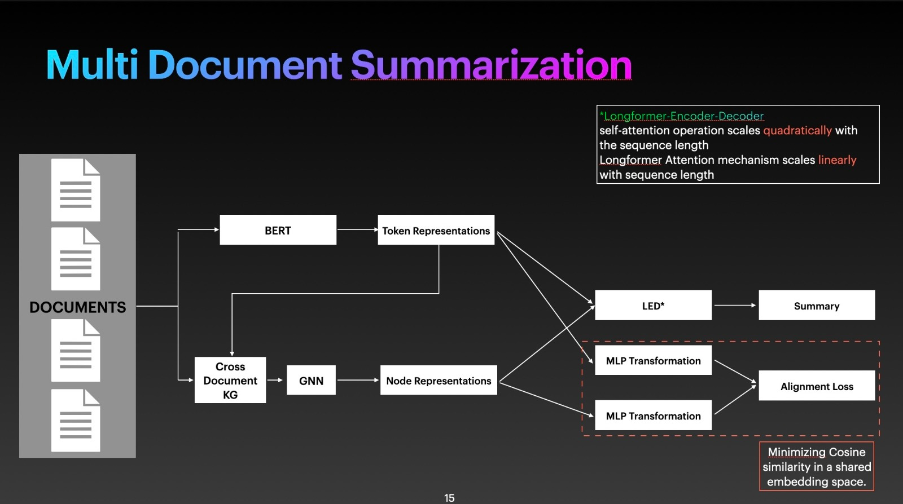
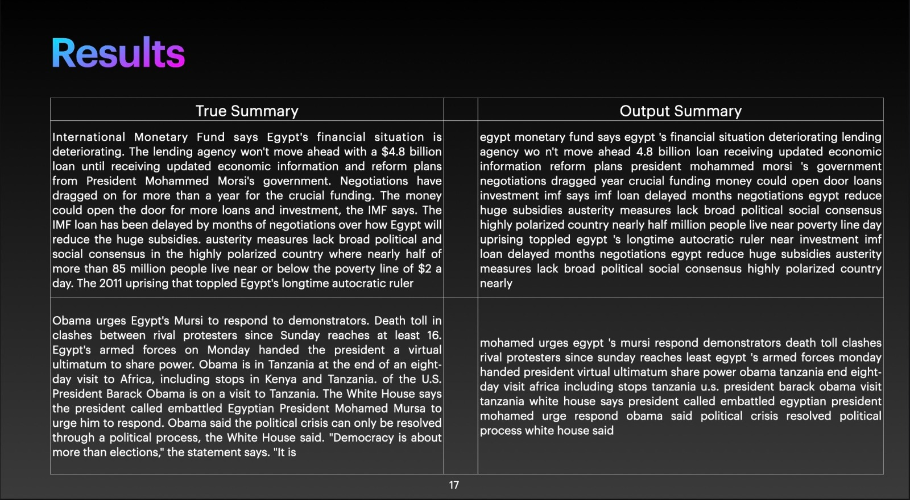
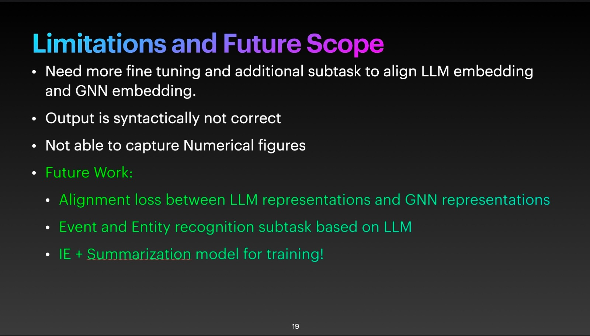

# Cross-Document-Summarization
Given a cluster of documents related to specific topic, task is to generate summary capturing relevant information with the help of GNN representations.

## Methodology

## Qualitative Results

## Limitations of Future Scope

